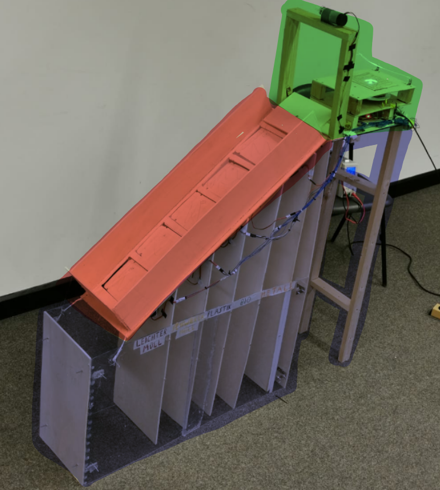
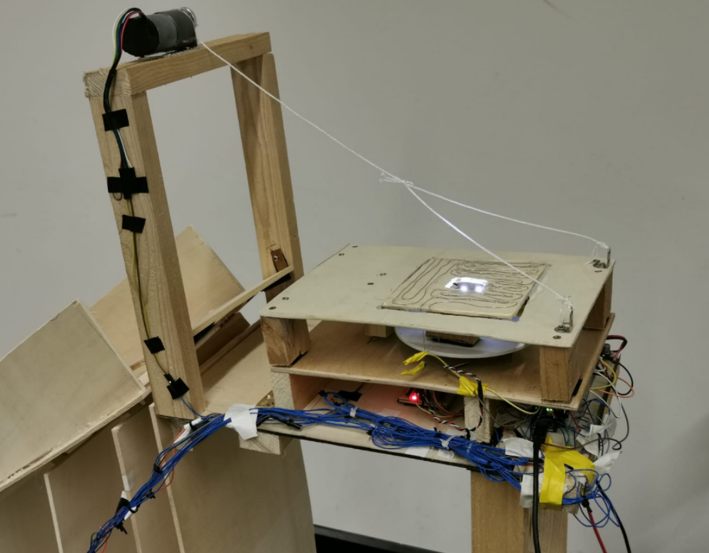
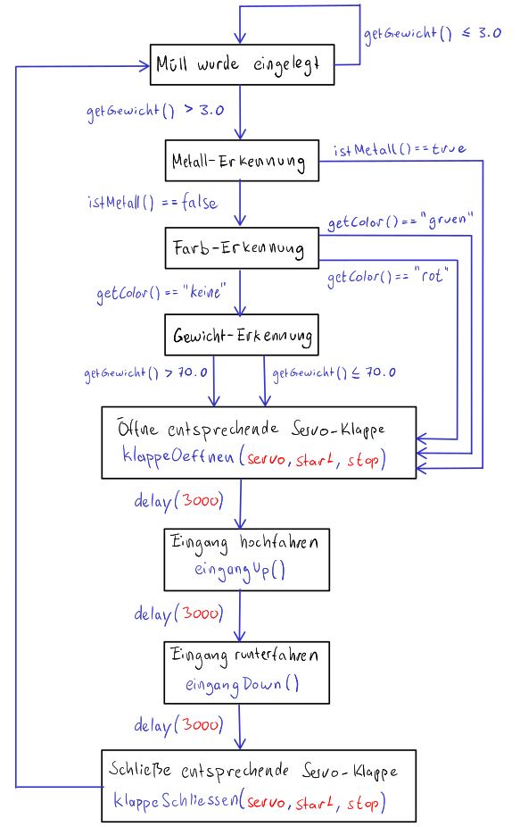
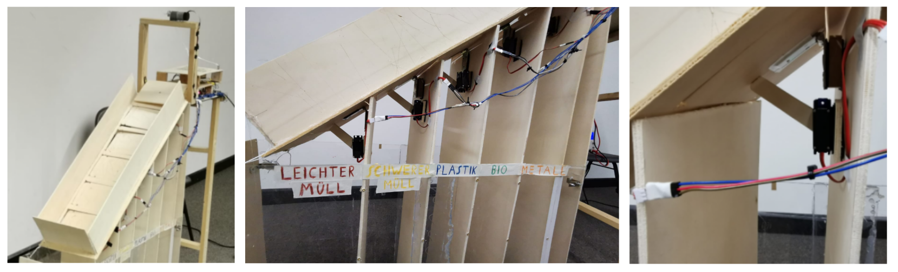
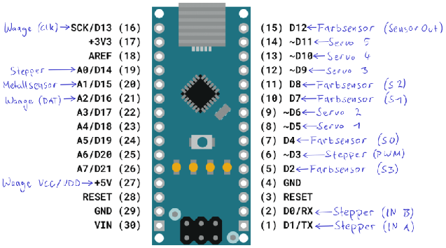

# The-Smart-Trash-Can

Projektdokumentation
====================

1\. Einleitung
--------------

Überfüllte Mülltonnen sind ein großes Problem für die Umwelt. Aber wie sehr achten die Menschen in Deutschland auf die Mülltrennung?
Laut einer [Statistik](https://de.statista.com/statistik/daten/studie/1225/umfrage/praktizierte-muelltrennung-in-den-eu-laendern/ "https://de.statista.com/statistik/daten/studie/1225/umfrage/praktizierte-muelltrennung-in-den-eu-laendern/") sind es in Deutschland nur 68%, die ihren Hausmüll zum Schutz der Umwelt trennen. Doch auch wenn man versucht den Müll mit bestem Gewissen zu trennen, kommt es vor, dass es bei bestimmten Abfällen an entsprechenden Mülltonnen oder an eindeutigen Beschriftungen mangelt, sei es im Haushalt oder auf öffentlichen Plätzen. Für dieses Problem soll „The Smart Trash Can“ eine Lösung bieten. Die Aufgabe von „The Smart Trash Can“ ist es, jeden Müll mit Zuverlässigkeit nach Kategorien zu analysieren und völlig automatisch und nachhaltig in dafür vorgesehene Mülltonnen zu befördern. Dies ist unsere Idee, um den Müll Einhalt zu gebieten.

* * *

2\. Umsetzung
-------------

### 2.1 Überblick über das Gesamtsystem

Der Roboter besteht aus drei wesentlichen Baugruppen (siehe *Abbildung 1*):

*   Eingangsbereich (Grün)

*   Verteilungssystem (Rot)

*   Grundkonstruktion (Blau)

Das Zusammenspiel dieser drei Baugruppen ermöglicht die Müll-Erkennung und Weiterleitung, wobei die Müll-Erkennung von mehreren Objekten gleichzeitig nicht möglich ist.
Die verschiedenen Baugruppen, einzelne Systembestandteile, Kriterien der Mülltrennung und weitere Details, werden im folgendem Abschnitt erläutert.

<figure>
  
  <figcaption>Abb. 1: Gesamtansicht</figcaption>
</figure>

### 2.2 Systembestandteile

Das Herzstück des Roboters befindet sich im **Eingangsbereich**, denn dort findet die Müll-Analyse statt. Hierbei helfen unterschiedliche Sensoren bei der Erkennung des Objekts.
Zwei abisolierte Drähte fungieren als Metall-Sensor, denn eine Spannung lässt sich messen, sobald ein Strom leitendes Objekt beide Drähte verbindet und somit den Stromkreis schließt. Ein Farb-Sensor liefert entsprechende Messergebnisse, die sich in RGB-Werte (0-255) konvertieren lassen, um somit Farben bestimmen zu können. Hierbei unterscheiden wir nur zwischen zwei Farben Grün (symbolisch für Bio-Müll) und Rot (symbolisch für Plastik-Müll). Um das Gewicht der Objekte messen zu können, ist eine Waage verbaut, wobei hier ein Analog-to-Digital Konverter (siehe Materialliste) benötigt wird.
Eine Detailansicht des Eingangsbereichs, mit oben genannten Sensoren, ist in *Abbildung 2* zu sehen.

<figure>
  
  <figcaption>Abb. 2: Eingangsbereich</figcaption>
</figure>

 

Mithilfe der von den Sensoren erhaltenen Messergebnisse, findet nun die eigentliche Müll-Analyse statt. Betrachte dazu auch den Programmablaufplan in *Abbildung 3*.
Im ersten Schritt, überprüfen wir das Gewicht der Waage. So können wir feststellen, sobald ein Benutzer Müll eingelegt hat. Wir wählen hierbei einen Schwellenwert von 3.0 Gramm aus, um Messfehler zu verringern. Im nächsten Schritt wird nun auf Metall geprüft, besser gesagt auf die Stromleitfähigkeit eines Objekts. Nun kommt es zu einer Abzweigung. Handelt es sich bei dem Objekt um Metall, so öffnet sich die entsprechende Müll-Klappe, die Eingangsplattform fährt hoch, der Müll rutscht runter, die Eingangsplattform fährt runter und auch die Müll-Klappe schließt sich wieder. Handelt es sich aber um kein Metall, so wird im folgendem Schritt auf die Farbe geprüft. Wird die Farbe Grün oder Rot erkannt, so öffnet sich wieder die entsprechende Müll-Klappe, die Eingangsplattform fährt hoch, der Müll rutscht runter, die Eingangsplattform fährt runter und die Müll-Klappe schließt sich wieder. Wird jedoch weder eine Grüne noch rote Farbe erkannt, so überprüfen wir im letzten Schritt das Gewicht des Objekts. Alles über dem Schwellenwert von 70.0 Gramm zählt als schwerer-Müll und öffnet somit die entsprechende Klappe für schweren-Müll. Alles kleiner oder gleich 70.0 Gramm zählt dementsprechend zum leichtem-Müll. Mit dieser abschließenden Prüfung des Gewichts, wird also auch sichergestellt, dass alle Objekte zugeordnet werden und kein Gegenstand unsortiert bleibt.

 <figure>
   
   <figcaption>Abb. 3: Programmablaufplan</figcaption>
 </figure>

  

Sobald dann die Hauptarbeit der Müll-Analyse abgeschlossen ist, gelangt der Müll in das **Verteilungssystem** und rutscht so in die entsprechende Mülltonne. Bei dem Verteilungssystem handelt es sich um eine Rutsch-Konstruktion, bestehend aus fünf Servo-Motoren, die Müll-Klappen steuern. Hierbei sind die Servo-Motoren unter der Rutsche, an den Trennwänden der **Grundkonstruktion** befestigt. Dadurch ist es möglich die komplette Rutsche manuell hochzuklappen, wodurch die Arbeit am Grundgerüst um einiges erleichtert wurde.
Das Verteilungssystem, mit dem am Grundgerüst befestigten Servo-Klappen, stellte für uns eine handwerkliche Herausforderung dar, die wir stark unterschätzt hatten. Wir mussten sehr präzise arbeiten und die Scharniere, Servo-Motoren und Müll-Klappen Millimeter genau ausrichten. Nur so konnte sichergestellt werden, dass sich die Müll-Klappen ordnungsgemäß bewegen und der Müll nirgendwo verkanntet.
Detailansichten des Verteilungssystems sind in *Abbildung 4* zu sehen.

<figure>
  
  <figcaption>Abb. 4: Verteilungssystem</figcaption>
</figure>

### 2.3 Technische Daten

In diesem Abschnitt werden wir alle von uns verbauten Materialien auflisten, hierbei unterteilen wir wieder in die drei Baugruppen: Eingangsbereich, Verteilungssystem und Grundkonstruktion. Außerdem werden wir mit Bemerkungen ergänzen, die bei der Weiterentwicklung von „The Smart Trash Can“ hilfreich sein könnten. Wir stellen ebenfalls eine Grafik mit der Pinbelegung am Arduino Nano zur Verfügung (siehe *Abbildung 5*).

**Eingangsbereich:**

*   1x Arduino Nano

*   1x Breadboard

*   2x Abisolierte Drähte (Metallsensor)

*   1x Farbsensor

*   1x Waage (Gewichtssensor)

*   1x HX711 24-Bit Analog-to-Digital Konverter

*   1x Getriebemotor

*   1x Monster Motor Shield VNH2SP30

*   1x Step-Down Konverter

*   1x Externe Stromquelle

*   2x Scharniere

**Verteilungssystem:**

*   5x Servo-Motoren

*   5x Scharniere

*   5x Holzklappen

**Grundkonstruktion:**

*   Holz

*   Acryl-Glas

<figure>
  
  <figcaption>Abb. 5: Pinbelegung</figcaption>
</figure>

 

_**Bemerkungen:**_

1.  Die Kalibrierungswerte sollten vor der Benutzung neu bestimmt werden (beachte dazu die Kommentare in TheSmartTrashCan.ino).

2.  Aufgrund des hohen Stromverbrauchs der Motoren, sollte eine externe Stromquelle, sowie ein Step-Down Konverter verwendet werden.

3.  Da der Code für die Waage aktuell (am 06.08.2021) noch nicht reibungslos funktioniert, können die Objekte nicht nach Gewicht sortiert werden, was bedeutet, dass die letzen beiden Klappen / Müll-Fächer ungenutzt bleiben. Die Waage funktioniert so, dass sie erst Messergebnisse liefert, sobald man sie ansteuert. Wenn man nun aber zuerst ein Objekt auf die Waage legt und sie erst später ansteuert (so wie wir es gemacht haben) bekommt man Messergebnisse nahe 0. Ein weiteres Problem ist, dass die Messergebnisse nur langsam (abhängig von dem Gewicht) auf den Maximalen-Wert „hochfahren“. Wenn man beispielsweise 132 Gramm auf die Waage legt, lässt sich ein Wert von ca. 132 Gramm erst nach einiger Zeit Messen. Um die genannten Probleme zu eliminieren, könnte man ein Signal an die Waage senden, bevor ein Objekt eingelegt wird, z.B. durch Knopfdruck des Benutzers. Sobald dieses Signal erhalten wurde, soll der Maximal gemessene Wert in einer Variablen gespeichert werden, um diesen Wert später wiederverwenden zu können. Eventuell könnten hier die Funktionen `get_value()` und `get_units()` mit dem zusätzlichen Parameter „times“ hilfreich sein. Diese Funktionen sind aus der [HX711 library](https://github.com/bogde/HX711 "https://github.com/bogde/HX711") und liefern den durchschnitt mehrerer Messungen, anstatt einer einzelnen.

* * *

3\. Ergebnis und Diskussion
---------------------------

Damit kommen wir nun zum Fazit und dem Ergebnis, welches sich aus dem Demonstrationsvideo entnehmen lässt.
Auch wenn „The Smart Trash Can“ noch einige Probleme hat (siehe oberen Abschnitt), sind wir unglaublich stolz den Roboter vor uns zu sehen, da er vor einigen Monaten nur eine grobe Idee in unseren Köpfen war. Letztendlich haben wir auch erfahren, wie viel Arbeit so ein Projekt in Anspruch nehmen kann und das nicht immer alles nach Plan verläuft. Wir würden uns freuen, wenn „The Smart Trash Can“ in den nächsten Semestern weiterentwickelt wird und sind überzeugt, eine hochentwickelte Version unseres Roboters irgendwann auf dem TU-Campus sehen zu können.
Abschließend haben wir eine Menge gelernt und wissen nun besser als zuvor, wie man solche Projekte bewältigen kann!

* * *

_**Hinweise zum Code:**_

*   Die Kalibrierungswerte müssen manuell bestimmt werden (siehe TheSmartTrashCan.ino Zeile 42-46 und 73-77).

*   Die Zeile 55 in TheSmartTrashCan.ino muss auskommentiert werden, da die Motoren sonst nicht angesteuert werden (Wir haben nicht herausgefunden warum).

*   Die Zeilen 139-163 in TheSmartTrashCan.ino sollen das Gewicht eines Objektes prüfen. Da dieser Teil noch nicht funktioniert, haben wir ihn auskommentiert.
